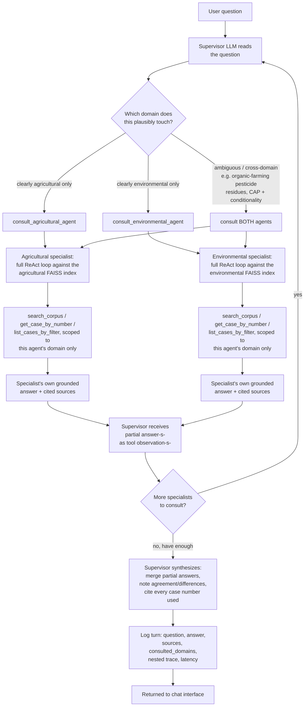

# Multi-agent (Task B) — flowchart

Mermaid source below renders automatically on GitHub. To export as an image
for the slide deck: paste this block into https://mermaid.live and export
PNG/SVG, or run `npx @mermaid-js/mermaid-cli -i multi_agent_flow.md -o multi_agent_flow.png`
locally (requires Node.js).

**Where routing happens:** step C — entirely inside the supervisor's own
reasoning (no separate classifier model); it is explicitly instructed to
consult **both** specialists rather than guess a single domain whenever the
question is ambiguous.

**How specialized agents are described/selected:** each `DomainAgent` is
handed to the supervisor only as a callable tool (`consult_agricultural_agent`
/ `consult_environmental_agent`) with a one-line description; the supervisor
never sees the specialists' internal tools or FAISS indices directly — full
separation of concerns.

**How partial answers return and merge:** each specialist runs its *entire*
own retrieval/reasoning loop (steps E→G) before returning one finished,
cited answer plus its `sources` list back to the supervisor as a single tool
observation (step H); the supervisor's final synthesis step (J) is a plain
LLM call over both specialists' text, not a second retrieval pass — the
supervisor itself never touches the corpus.
