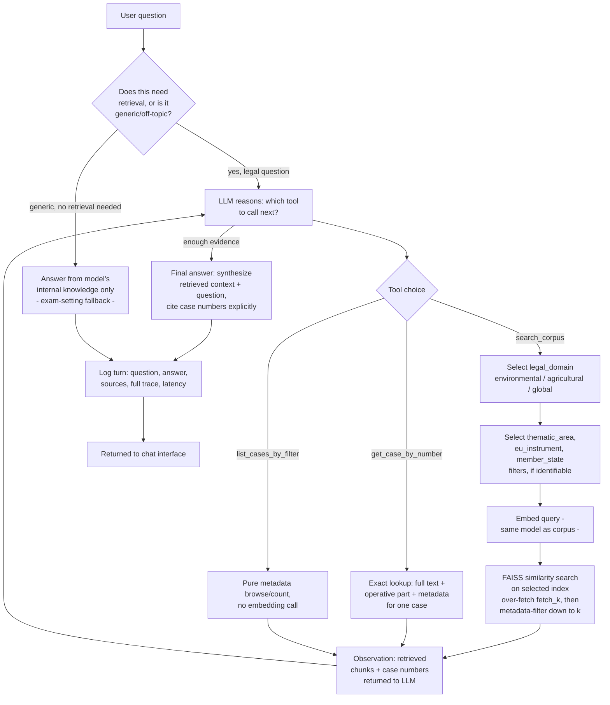

# Single-agent (Task A) — flowchart

Mermaid source below renders automatically on GitHub. To export as an image
for the slide deck: paste this block into https://mermaid.live and export
PNG/SVG, or run `npx @mermaid-js/mermaid-cli -i single_agent_flow.md -o single_agent_flow.png`
locally (requires Node.js).

**Where routing happens:** step E/E2 (domain, thematic area, instrument,
Member State selection) and step G (FAISS index choice + metadata filter +
re-ranking by cosine similarity). The LLM decides *which* filters to apply
based on its own reading of the question — there is no separate classifier
model.

**Where context is constructed:** step H accumulates every tool
observation across the loop into the running conversation; step K is where
the LLM combines all accumulated observations with the original question to
produce the final, cited answer.
