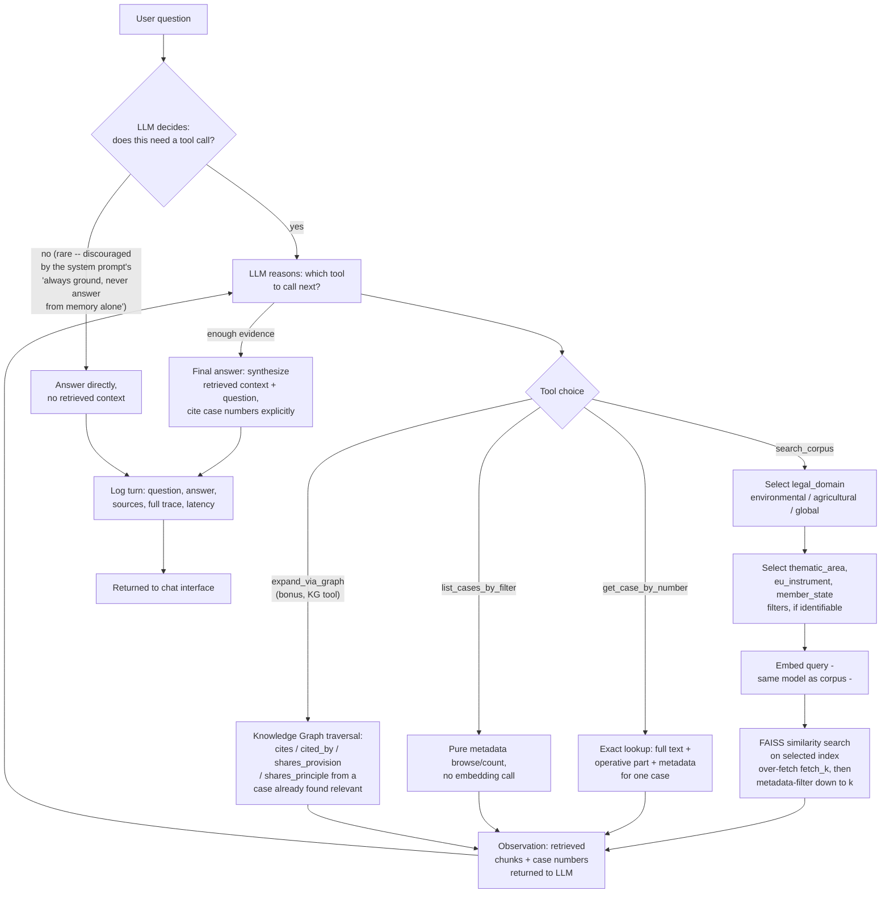

# Single-agent (Task A) — flowchart

Mermaid source below renders automatically on GitHub. To export as an image
for the slide deck: paste this block into https://mermaid.live and export
PNG/SVG, or run `npx @mermaid-js/mermaid-cli -i single_agent_flow.md -o single_agent_flow.png`
locally (requires Node.js).

**Design note on the "no retrieval" branch:** the guide's Sec. 3.2 describes
an explicit Thought step that can skip retrieval for "genuinely generic"
questions. In this implementation that decision is left implicit in the
model's own tool-use choice rather than a separate classifier call, and the
system prompt actively discourages taking it ("always ground your answers
in retrieved judgments -- never answer from memory alone"), reserving it
for the rare case where the model judges a question needs no corpus lookup
at all. This is a deliberate choice given the exam's own anti-hallucination
emphasis (Sec. 6.3's Q20 grounded-refusal test): none of the 20 evaluation
questions are generic enough to take this branch in practice, so the system
effectively always grounds on the graded set.

**Where routing happens:** step E/E2 (domain, thematic area, instrument,
Member State selection) and step G (FAISS index choice + metadata filter +
re-ranking by cosine similarity). The LLM decides *which* filters to apply
based on its own reading of the question — there is no separate classifier
model.

**Where context is constructed:** step H accumulates every tool
observation across the loop into the running conversation; step K is where
the LLM combines all accumulated observations with the original question to
produce the final, cited answer.
